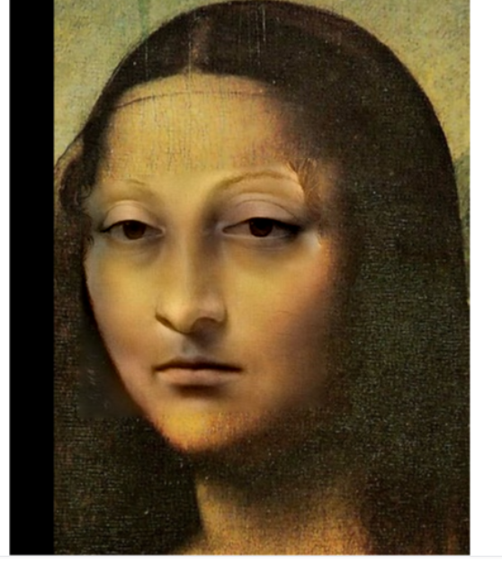

# Poisson Image Blending

Poisson Image Blending 是一种用于图像融合的算法，通过调整图像边界区域的颜色，使得前景对象无缝地合并到背景中。本文档将简要介绍 Poisson 图像混合的理论基础、目标以及实际效果。

## 理论基础

Poisson 图像混合的核心原理是解决泊松方程。给定前景图像区域 \(\Omega\) 及其边界 \(\partial\Omega\)，算法目标是将前景图像的梯度场 \( \nabla f \) 传递到背景图像中，进而使前景与背景在边缘处实现颜色和纹理的连续过渡。

泊松方程形式如下：
\[
\Delta g = \nabla \cdot f \quad \text{in } \Omega
\]
其中 \( g \) 是融合后的图像，\( f \) 是前景图像的梯度。通过计算 \( g \) 的值并进行边界条件约束，Poisson 混合使得图像内部梯度最小化误差，从而确保了无缝的过渡效果。

### 数学步骤

1. **梯度场重构**：提取前景图像的梯度，以形成新的梯度场。
2. **边界条件设定**：使用背景图像在边界上的颜色值作为泊松方程的边界条件。
3. **求解泊松方程**：通过数值方法（如有限差分法）求解泊松方程，得到融合后的像素值。

这类方法的优势在于，混合后的图像可以较好地保留前景物体的细节，并平滑其边缘，使其自然地融入背景图像。

## 实验结果

我们测试了 Poisson 图像混合在多种图像类型上的效果，包括：

## 评价指标

为了量化 Poisson 混合的效果，我们使用了以下评价指标：

- **边缘过渡质量**：观察边缘区域的色彩一致性和梯度变化。
- **细节保持率**：评估前景图像细节的保留程度。
- **无缝度评分**：对融合效果进行主观评分。

## 结论

Poisson 图像混合在前景与背景之间的过渡方面表现出色，尤其适用于颜色和纹理匹配要求较高的图像合成任务。然而，该算法也有一些局限性，比如在光照差异较大的场景下，融合效果可能不够理想。未来的改进方向包括融合光照补偿技术，以提高在不同场景下的适用性。

---

**关键词**: Poisson 图像混合, 泊松方程, 图像处理, 图像融合, 计算机视觉